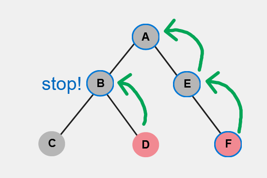
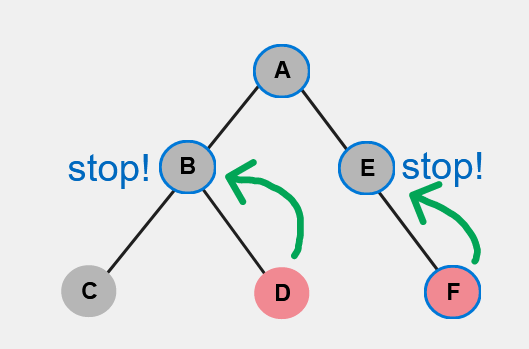
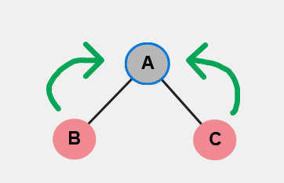

# Editable Tree Events

This describes an API for receiving change notifications from SharedTree.
These notifications are used by an app to respond to changes and update the UI.
There exists already an API for this (see AnchorEvents and EditableTreeEvents), but we'd like to refine it to make it simpler, more conventional and more powerful.

## Basic API

We expect that many users will be satisfied with an event available for subscription on each node in the tree (e.g. `change`).
Such an event fires its listeners if the node itself changes or if any node underneath it changes.
So, registering a change event on a node means "notify me if the _subtree_ rooted at this node changes in any way".
For example:

```ts
// A shared text input field, represented by a node in the tree, is updated
textFieldNode.on("change", () => {
	myTextField.setText(textFieldNode.text);
});
```

## Before/After

Some application scenarios will find it desirable to inspect the state of the tree just _before_ a change happens, whereas others will want to know the state of the tree after the change finishes applying.
So, rather than one `change` event, we intend to have two events:

```ts
node.on("beforeChange", () => {});
node.on("afterChange", () => {});
```

Users who are only interested in one of them can simply ignore the other.

## Capturing/Bubbling

Other eventing libraries that are built upon trees have a way for event listeners to intercept events "on their way down the tree" and "on their way back up".
For example, this is referred to as event "tunneling and bubbling" in WPF or ["capturing/trickling and bubbling" in the browser DOM](https://stackoverflow.com/a/4616720).
This feature can be useful both for correctness as well as for performance, so we'd like to include it.
Both `beforeChange` and `afterChange` events will have their own respective capture and bubbling phases (e.g. "capture before", "bubble before", "capture after", "bubble after").
[Mimicking the DOM convention](https://developer.mozilla.org/en-US/docs/Web/API/EventTarget/addEventListener#parameters), registrations bubble by default but can be registered for capture instead at registration time:

```ts
node.on("afterChange", () => {}); // Bubble
node.on("afterChange", () => {}, true); // Capture
```

When a node is about to change, `beforeChange` events registered for capturing are fired for all ancestors of that node from top to bottom (i.e. listeners are called in the order of shallowest to deepest in the tree, starting at the root and ending at the changed node, inclusive).
Then, `beforeChange` events registered for bubbling are fired for all ancestors, this time from bottom to top.
Next, the tree is updated with the changed data.
`afterChange` events registered for capture are then fired, once again from top to bottom, followed by `afterChange` events registered for bubbling, bottom to top.

## Event Anchoring

When an event is registered on a node, it is associated with that node's "anchor".
If the node moves to a new location in the tree, for example, the event registration will move with it.
It is possible for a node to be in a different place in the tree during the `beforeChange` event vs. the `afterChange` event, and in that case the ancestry/capture/bubble paths will be different for each of those events.

## Stop Propagation

Another feature of eventing libraries structured around trees is the ability to "block" an event during the capturing or bubbling phase.
We would like this feature since it helps an app to control which components get which messages from which parts of the tree without having to keep its own "event-was-handled state machine".
We plan to follow the convention used in the DOM, called [`stopPropagation`](https://developer.mozilla.org/en-US/docs/Web/API/Event/stopPropagation).

Since there are four phases in our events ("capture before", "bubble before", "capture after" and "bubble after"), there are four opportunities to stop the event progression.
Stopping the propagation of a capture event will also prevent the corresponding bubble events.
For example, calling `stopPropagation()` on an ancestor of the changed node in the `beforeChange` event where capture is `true` will stop all remaining `beforeChanged` events from being fired for that change, including those where `capture` is `false`/`undefined`.
However, it will not affect calls to `afterChange` for that node; `beforeChange` and `afterChange` are distinct events and their `stopPropagation()`s do not interact with each other.

## Stop Immediate Propagation

There is function exposed by the DOM called [`stopImmediatePropagation`](https://developer.mozilla.org/en-US/docs/Web/API/Event/stopImmediatePropagation) that is similar to `stopPropagation`.
Assuming it is trivial to implement after implementing `stopPropagation`, it should be included in the API as well.

## Event Batching

So far, the behavior and interactions of event ordering and `stopPropagation()` are clear because we've only considered the case where a single node in the tree changes at once.
This is analogous to interactions in the browser DOM; one action (e.g. a mouse click) takes place at a time.
However, it is possible for a SharedTree to have multiple nodes changed "at once".
This could occur because multiple changes were squashed together by a transaction or because a tree change is a composition of multiple smaller changes for performance reasons (e.g. to mitigate backpressure).
The behavior of `stopPropagation()` becomes less obvious when considering this case, so we'll examine it here.

### Capturing

A `beforeChange` or `afterChange` event subscribes to changes to the whole subtree rooted at the node of registration.
Therefore, if an event subscribes to the capture phase and calls `stopPropagation()`, the natural intent seems to be "stop the event from propagating to all listeners in this subtree".
So, in the case where two siblings/cousins change at once and their common ancestor calls `stopPropagation()` during the capture phase, any listeners below that common ancestor (that care about either or both nodes) will be prevented.
If two handlers are registered on the same node where one of them calls `stopPropagation()` and the other does not, the propagation will be stopped.

### Bubbling

The bubbling case is a little bit different than the capturing case.
Because an event subscribes to changes to the subtree, the natural intent of calling `stopPropagation()` during the bubble phase seems to be "stop changes from within this subtree from notifying any listener above".
However, it shouldn't prevent _other_ subtrees that have changed from notifying their ancestry.
Therefore, propagation only truly stops if _all_ relevant listeners have called `stopPropagation()`.
More specifically, a listener is called during the bubble phase if and only if there is at least one listener on a node in its subtree which does not call `stopPropagation()` and is not underneath another node in the subtree with a listener that calls `stopPropagation()`.

That makes it sound more complicated than it is; some things are best explained with pictures.
In these tree diagrams, the red nodes have all changed simultaneously and the green arrows trace the events as they bubble to the listeners (represented by blue outlines around the nodes).

---



Here, the change in node `D` causes node `B` to receive a change event, because node `D` is in the subtree rooted at node `B`.
Node `B` calls `stopPropagation()`, which means that anything above node `B` (in this case, node `A`) should not be notified of the change in node `D`.
However, node `A` still receives an event that its subtree changed because node `F`, which is also part of its subtree, changed and the event was allowed to propagate up.
Thus, the sequence of events here is `[F, (B, E), A]`.
The events on nodes `B` and `E` may be fired in either order; it (in theory) does not matter since they are at the same depth in the tree.

---



Here, the event propagation begins the same as the previous example but with an additional call to `stopPropagation()` by the listener on node `E`.
This means that there is no longer a desire from any listener below to bubble the change event to node `A`.
Note that the listener on node `F` did _not_ call `stopPropagation()`, but that is irrelevant with respect to node `A` because an ancestor of node `F` (node `E`) _did_ call `stopPropagation()`.
The sequences of events here is `[F, (B, E)]`; node `A`'s listener is not called.

---



Also note that if multiple changes bubble to the same ancestor, they are deduplicated.
That is, the sequence of events here is `[A]` not `[A, A]`.

---

Similar to the capturing phase, if two handlers are registered on the same node where one of them calls `stopPropagation()` and the other does not, then bubbling will be stopped.

## Fine-Grained Events

The APIs above are simple and intuitive, but are not powerful enough for some advanced used cases with strict performance requirements.
Some users want to know not just where the tree has changed, but _how_ it has changed.
This is useful for customers who have an additional representation of the tree's data beyond the SharedTree itself and wish to directly reflect the changes to the tree in their model.

For such a case, we provide an additional event:

```ts
node.on("visitChanging", (visitor) => {
	visitor.on("inserted", (path) => {});
	visitor.on("deleting", (path) => {});
});
```

The `visitChanging` event can be registered on any node and, like the other events, is fired if any node in the subtree changes.
However, it provides a "visitor" object which itself exposes various "fine grained" events about where and how the subtree changes.
The visitor processes changes to nodes one by one in depth-first pre-order so that the user can "follow along" and make the equivalent changes to their model.
It is inefficient and somewhat difficult to provide access to the state of the tree itself during intermediate states, so the tree may not be read in the middle of a `visitChanging` event.
Or, if it is read (via e.g. a path lookup), it will reflect the state of the tree before any of the changes happened (i.e. the state of the tree when `beforeChanged` occurred).
See `VisitorEvents` in [editableTreeEvents.ts](./editableTreeEvents.ts) for the full list of visitor events.
